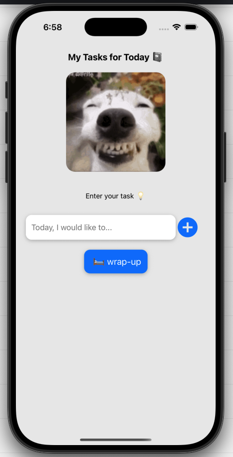
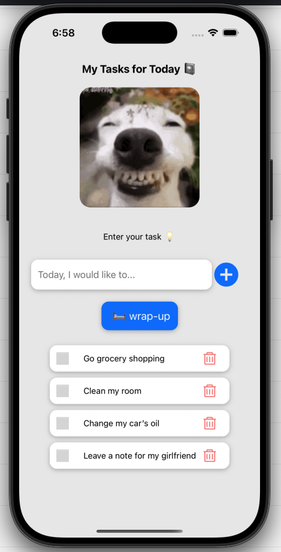
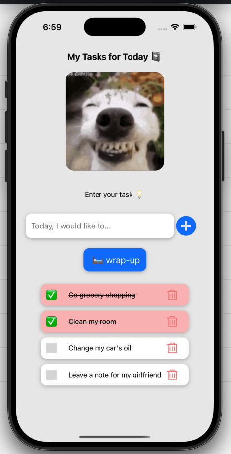
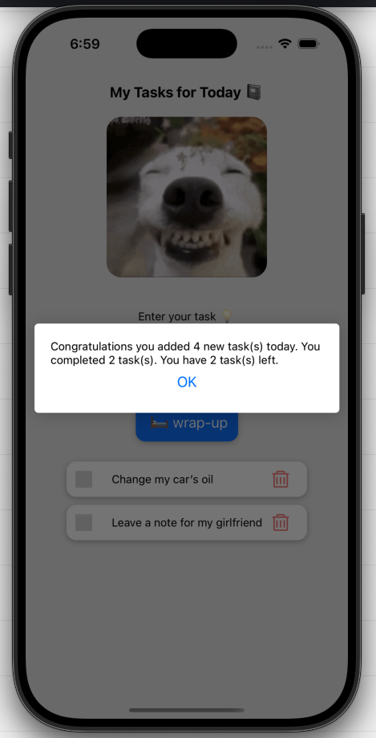

# To-Do App (Re-Vamped) 💻: 

## Description 📝:
This is a to-do app created using React Native JavaScript. I was creating a different app before using a linked list and multiple pages, and I realized I was going overkill. The project was way way too complicated for what it needed to be. This is a scaled-down, less overly complex version.

I created this to help teach myself React Native framework. 

## Installation 🛠️:
Install the files from GitHub, then in the project directory, perform the following commands:

```
npm install
```

```
npx expo install react-dom react-native-web @expo/metro-runtime expo-image expo-av
```

```
npx expo start
```

## UI Design 🎨





